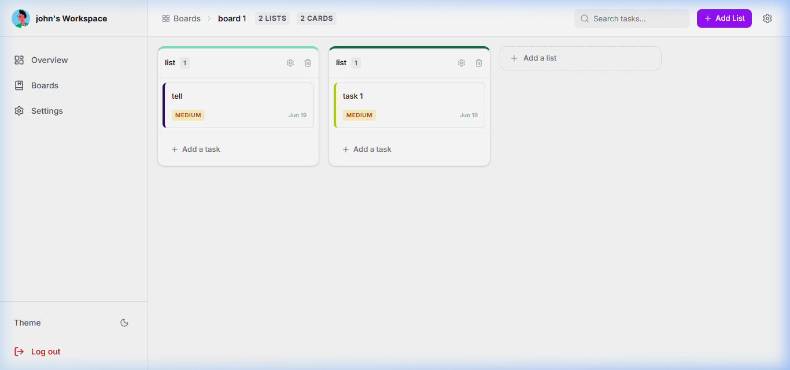
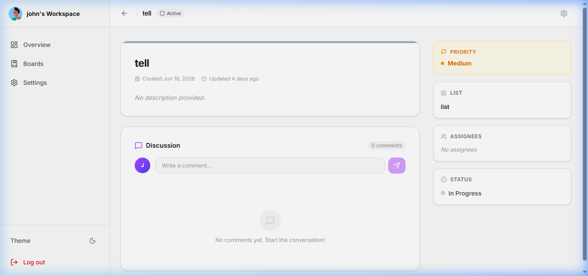

<div align="center">
  <h1 align="center">Kanban Task Board - Frontend</h1>
  <p align="center">
    A modern, highly interactive Kanban board application built with React, TypeScript, and Tailwind CSS. Featuring real-time collaboration and seamless drag-and-drop task management.
  </p>
  <p align="center">
    <a href="https://kanban.shubhxmtechnologies.workers.dev" target="_blank"><strong>🚀 View Live Demo</strong></a>
  </p>
</div>

<hr />

## ✨ Key Features

- **Intuitive Drag and Drop:** Seamlessly move tasks between columns using `@dnd-kit` for a fluid user experience.
- **Real-Time Collaboration:** Instant updates across all connected clients powered by `Socket.io`.
- **Modern UI/UX:** Clean, responsive design implemented with `Tailwind CSS` and elegant icons from `Lucide React`.
- **Robust State Management:** Lightweight and fast global state management utilizing `Zustand`.
- **Type-Safe:** Built completely in `TypeScript` to ensure reliability and maintainability.

## 📸 Screenshots

*(Replace the paths below with your actual screenshot images in a `screenshots` folder)*

| Kanban Board View | Task Details Modal |
| :---: | :---: |
|  |  |
| *Seamless drag-and-drop task management* | *Detailed task view and editing* |

## 🛠️ Technologies Used

- **Framework:** React 19 + Vite
- **Language:** TypeScript
- **Styling:** Tailwind CSS v4
- **State Management:** Zustand
- **Drag & Drop:** @dnd-kit (Core & Sortable)
- **Real-Time:** Socket.io-client
- **Routing:** React Router DOM
- **HTTP Client:** Axios
- **Notifications:** React Hot Toast

## 🚀 Getting Started

Follow these steps to set up the project locally.

### Prerequisites

- Node.js (v18 or higher recommended)
- npm or yarn

### Installation

1. **Navigate to the frontend directory:**
   ```bash
   cd frontend_kanban
   ```

2. **Install dependencies:**
   ```bash
   npm install
   ```

3. **Configure Environment Variables:**
   Create a `.env.local` (or `.env`) file in the root of the `frontend_kanban` directory and add the following configuration:
   ```env
   VITE_API_URL=http://localhost:5000
   VITE_SOCKET_URL=http://localhost:5000
   ```
   *(Update these URLs if your backend is running on a different port/host during development)*

4. **Start the development server:**
   ```bash
   npm run dev
   ```
   The application will be available at `http://localhost:5173`.

## 📦 Build for Production

To create a production-ready build, run:
```bash
npm run build
```
The compiled assets will be available in the `dist` directory.
